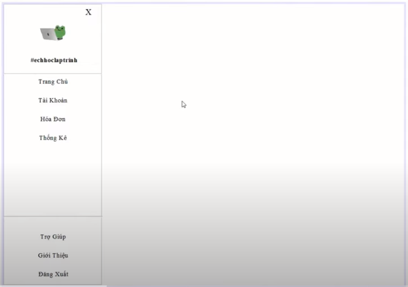
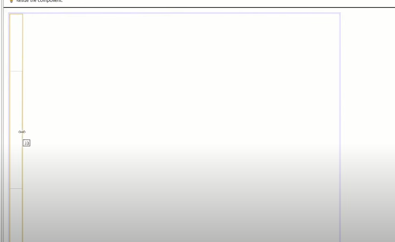
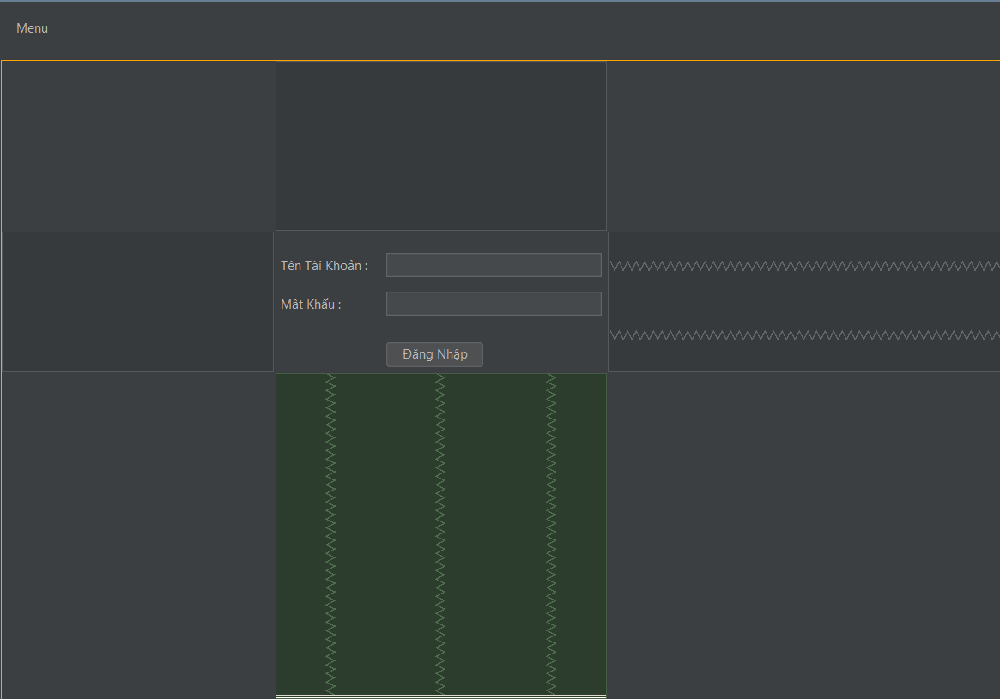
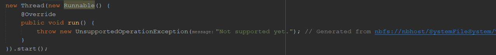
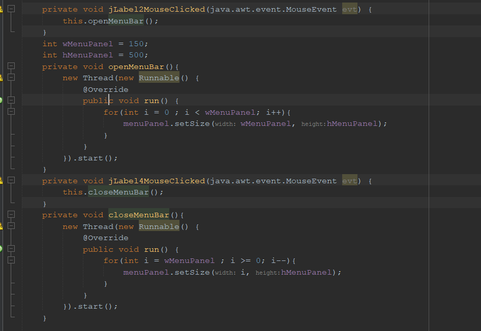

# Tạo menu chuyển động
## B1: Tạo 1 Panel lớn
## B2: Tạo Panel cho menu, có nút bấm và các Label
- Trang chủ, tải khoản, hóa đơn... hình như là Label.
- 
- Nhớ lưu lại chiều dài, rộng.
- Kéo nó vào trong:
- 
## B3: Tạo 1 Label cho trang chủ.
- 
## B4: Sử dụng MouseClicked Event của JLabel để gọi vào phương thức mở Menu Panel
- 
## B5: Sử dụng tính chất đa luồng để tạo:
- Thực chất khi ta mở Menu cho nó chạy là nó đang chạy trên 1 luồng khác.
- 
- (Cái bên trên kiểu Anonymus Class)
- thay đổi cái run thôi.
- 
- Cái luồng chạy thì ko cần chạy for cũm đc, nhưng chạy for thì sẽ có hiệu ứng mở.