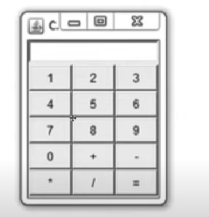
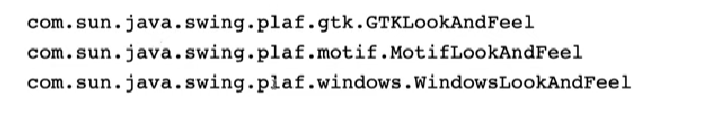

# Cách sử dụng JPanel và cấu hình Look and Feel cho giao diện chương trình Java
## VD:Tạo 1 giao diện như sau: 

## 1. JPanel
## 2. Look and Feel: 
1. 1 số loại look and feel:.
## 3. Thay đổi Look and Feel sau Start Up
1. UIManager chọn Look-and-Feel như thế nào?
- UIManager cài đặt LaF theo các bước sau:
- Nếu trong code có set LaF (như trên), UIManager sẽ tạo ra một thể hiện của LaF Class được chỉ ra. Nếu thành công, tất cả component sẽ sử dụng LaF này.
- Nếu không thành công, UIManager sẽ sử dụng LaF được chỉ ra bởi thuộc tính swing.defaultlaf. Nếu thuộc tính này được chỉ ra trong cả swing.properties file và trên command line thì trên command line sẽ được ưu tiên.
- Nếu kết quả 2 bước trên vẫn không xác định được 1 LaF hợp lệ, JRE sẽ sử dụng Java LaF. Ngoại trừ trên MAC sử dụng LaF riêng.
2. Thay đổi Look-and-Feel sau startup
- Bạn có thể thay đổi LaF ngay cả sau khi ứng dụng đã hiện lên. Để làm được việc này, bạn gọi phương thức updateComponentTreeUI của SwingUtilities cho mỗi top-level container. Sau đó, bạn có thể phải resize mỗi top-level container này tới size mới để phù hợp với LaF mới.
-     ```java
    UIManager.setLookAndFeel(lnfName);
    SwingUtilities.updateComponentTreeUI(frame);
    frame.pack();
    frame.setSize(); // Set kích cỡ về theo kích cỡ ban đầu.
    ```