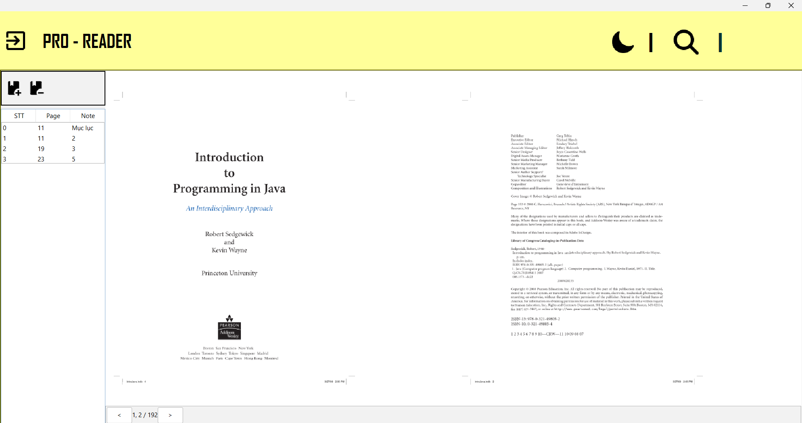
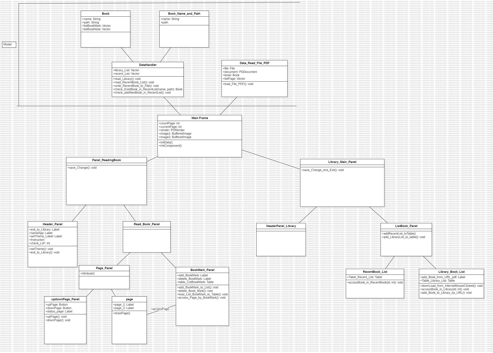
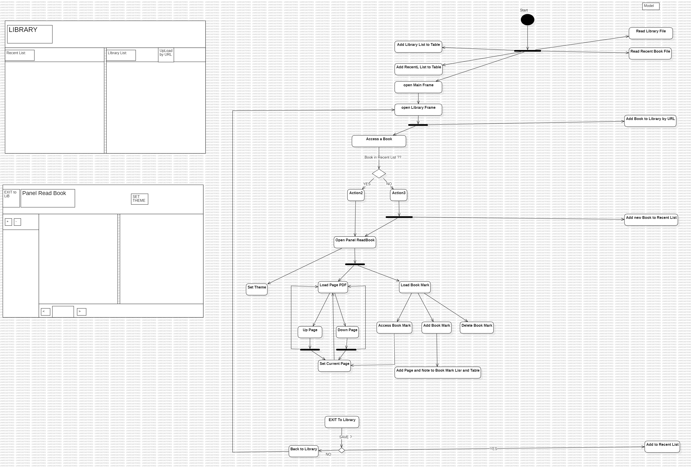

# [PRO - READER]

- Bài tập cuối khóa JAVA CORE của CLB Lập Trình PTIT.
- Tên dự án: PRO - READER
- Người thực hiện: Trần Xuân Sơn
- Ứng dụng giúp hỗ trợ đọc File PDF, có chức năng tương tự 1 app đọc sách cơ bản

## Authors

- [@kaita](https://github.com/Yamaaaaaaaa)


## Demo

Link Video Demo: `https://youtu.be/o2JUfya9fEI`


## Screenshots

Ảnh



## Features

Các chức năng chính của ứng dụng:
1. Đọc sách file PDF.
2. Đổi Theme: Dark - Light Mode.
3. Thêm, sửa, xóa, truy cập BookMark.
4. Tải File từ Internet, Upload File từ PC.


## Requirements

- Java 11
- Maven
- PDBox
- FlatLaf


## Installation

Cách cài đặt dự án

```bash
  - Clone dự án
  - Chạy ứng dụng
```

## UML:

1. Class Diagram:


2. Activity Diagram:

