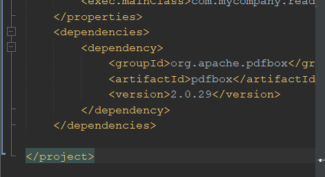
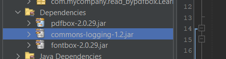
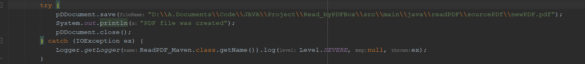
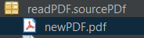
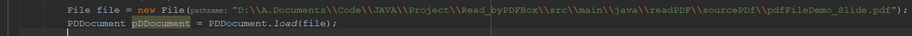
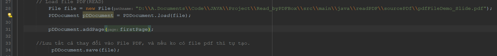
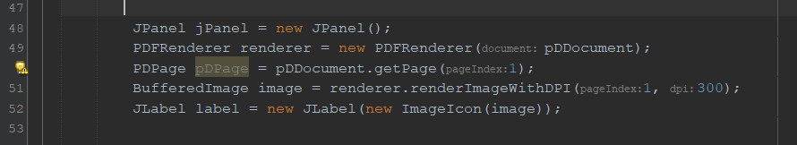

# B1: Tạo File Java Maven
# B2: Copy dòng code vào live pom.xml
1.  ```
        <dependency>
        <groupId>org.apache.pdfbox</groupId>
        <artifactId>pdfbox</artifactId>
        <version>2.0.29</version>
        </dependency>
    ```
    - Nếu lỡ xóa đi, thì Alt+Enter vào cái PDDocuments và Search Maven => local Search, chọn cái đã lấy
2. 
3. Nó sẽ hiện File này vào Dependences: 
# Các kiến thức liên quan:
## I. Create PDF
1. B1: Tạo Class PDF: 
   - 
2. 
3. Kết quả: 
   - 
4. Tạo 1 trang văn bản trong file PDF.
## II. PDFBox load PDF | PDFBox Load Existing PDF | PDFBox edit PDF
### 1. Load 1 File PDF
1. Tạo 1 Object PD được load dữ liệu từ File PDF cho trước:
   - 
   - VD: Add 1 page vao file:
     - 
## III. Pdfbox split pdf, java extract pages from pdf.
### IV. View PDF file in Panel.
1. 